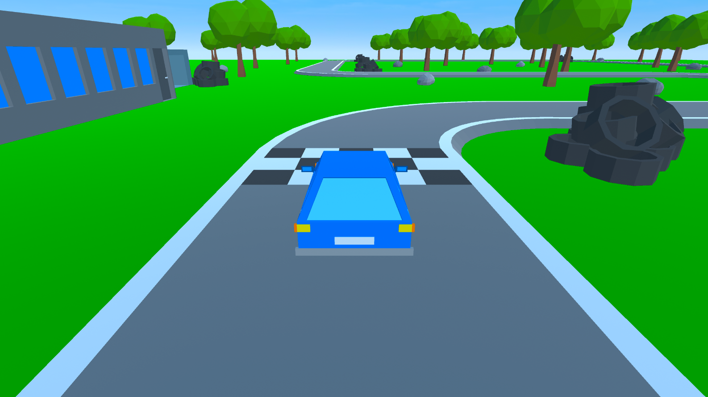

# Low Poly Racer

Low Poly Racer ist ein, wie der Name vielleicht schon verrät, Rennspiel im Low Poly Style mit selbstgemachten Assets. Es war 
mein erstes 3D Spiel in Unity. Die Rotation des Wagens wird im Programm selber berechnet (da Unitys Wheel Collider für mich
irgendwie nicht funktioniert haben).

